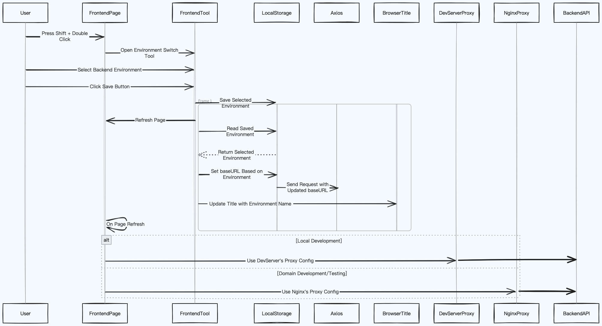

# 如何优雅的实现一套前端项目环境无缝切换多套后端环境

## 需求背景

在开发或者测试前端项目时，经常需要切换不同的后端环境，比如开发环境、测试环境、预发布环境、生产环境等，开发环境和测试环境又可能存在多套环境，比如dev1、dev2、fat1、fat2、...等，由于前端域名和后端接口请求的域名不一致，会产生跨域问题，跨域问题我们可以使用代理来解决。

前端项目切换后端环境有两个常用的场景，一种是在本地开发环境切换后端环境进行联调，使用频率最高，另一种是前端测试环境需要临时切换到后端环境进行测试，这种场景主要出现在某个迭代前端环境比后端环境少或者某个前端环境有问题暂时用不了需要应急使用。
针对第一种情况，本地开发环境可以使用webpack或者vite等前端打包构建工具提供的proxy代理功能，使用这种方式切换后端环境，每次都需要修改proxy代理配置文件，修改完配置文件以后还需要手动启动项目（vite会监听变化自动启动），但是不管是手动启动还是自动启动项目，开发人员都需要等待项目编译构建完成后才能进行联调测试，每次重启项目都会耗费几分钟甚至更长的项目编译时间(项目越大耗费时间越长)，而且每次都需要修改配置文件，操作比较繁琐。
针对第二种情况，开发/测试环境可以使用nginx反向代理，或者使用Fiddler、Whistle、Charles等代理工具，但是使用这些代理工具，需要下载安装，而且有一定的使用学习成本。**因此，我们需要设计开发封装一个环境切换工具，可以在不修改前端项目proxy配置文件代码且不重启项目的情况下，只需在项目页面选择需要切换的后端环境，然后刷新页面，即可无缝切换不同的后端环境。**

## 前期调研

目前，业界普遍的实现方案有以下几种：

针对本地开发环境：

方案一：直接使用前端打包构建构建提供的devServer proxy代理功能

使用webpack或者vite等前端打包构建工具提供的proxy代理功能，使用这种方式切换后端环境，每次都需要修改proxy代理配置文件，修改完配置文件以后还需要手动启动项目（vite会监听变化自动启动），但是不管是手动启动还是自动启动项目，开发人员都需要等待项目编译构建完成后才能进行联调测试，每次重启项目都会耗费几分钟甚至更长的项目编译时间(项目越大耗费时间越长)，而且每次都需要修改配置文件，操作比较繁琐。这也是目前业界最常用的实现方案。

示例代码如下（以webpack为例）：

```javascript
// webpack devsever proxy 配置
module.exports = {
  //...
  devServer: {
    // 预设需要切换的后端开发/测试环境代理
    proxy: {
      '/dev': {
        target: 'http://dev.backend.com',
        changeOrigin: true,
        pathRewrite: { '^/dev': '' },
      },
      '/fat': {
        target: 'http://fat.backend.com',
        changeOrigin: true,
        pathRewrite: { '^/fat': '' },
      },
      '/uat': {
        target: 'http://uat.backend.com',
        changeOrigin: true,
        pathRewrite: { '^/uat': '' },
      },
      '/prod': {
        target: 'http://prod.backend.com',
        changeOrigin: true,
        pathRewrite: { '^/prod': '' },
      },
    },
  },
};
```

方案二：利用 http-proxy-middleware 提供的 router 属性

利用 [http-proxy-middleware](https://github.com/chimurai/http-proxy-middleware) 提供的 `router` 属性，该属性可以动态覆盖devServer proxy中设置的 `target` 属性设置的值，而且router属性的值可以通过函数或者异步函数返回，所以我们可以通过异步函数去读取一个配置文件，然后根据配置文件中的值去动态设置router属性的值，从而实现动态切换后端环境。这种方案可以实现在不重启项目的情况下切换后端环境，但是这种方案每次切换后端环境还是需要去手动修改前端项目配置文件代码，而且无法实现同时预设多个环境。

```javascript
// webpack devsever proxy 配置
module.exports = {
  //...
  devServer: {
    proxy: {
      '/dev': {
        target: 'http://dev.backend.com',
        changeOrigin: true,
        pathRewrite: { '^/dev': '' },
        // router: () => url, // URL 会覆盖 target，成为新的代理地址，这个函数支持async异步操作
        router: () => fs.readFileSync(process.cwd() + '/.env.local', 'utf8'), // 函数返回的URL会覆盖target属性，成为新的代理地址，这个函数支持async异步操作，.env.local 的内容为 http://fat.backend.com
      }
    },
  },
};
```

针对开发/测试环境：

方案一：使用nginx反向代理

在开发/测试环境，我们一般会使用nginx反向代理，将前端项目部署在nginx服务器上，然后通过nginx.config配置文件中的location配置来代理请求到不同的后端环境，这样我们就可以通过修改nginx的配置文件来动态切换后端环境，而且不需要重启nginx，只需要重新加载nginx配置文件即可，该方案也是目前比较主流的方案。但是使用该方案需要对nginx配置有一定的了解，存在一定的操作和学习成本。

```nginx
server {
    listen       80;
    server_name  localhost;

    location / {
        root   /path/to/your/project;
        index  index.html index.htm;
        try_files $uri $uri/ /index.html;
    }

    location /dev/ {
        proxy_pass http://dev.backend.com;
    }

    location /fat/ {
        proxy_pass http://fat.backend.com;
    }

    location /uat/ {
        proxy_pass http://uat.backend.com;
    }
}
```

方案二：使用Fiddler、Whistle、Charles等代理工具

使用Fiddler、Whistle、Charles等代理工具，但是使用这些代理工具，需要下载安装，而且有一定的使用学习成本，而且每次切换后端环境都需要重新配置代理，操作比较繁琐。

## 前端环境切换工具

上述主流的实现方案，前端项目每次切换后端环境要么需要修改配置文件，要么需要重启项目，而且不能通过前端页面直观的看到自己所切换的后端环境，所以上述的主流方案并不是很完美，因此我们需要自主研发一种前端环境切换工具，该工具可以满足以下需求：

1. 不需要修改配置文件，也不需要重启项目，更不需要下载安装代理工具，只需要在前端页面选择切换的后端环境，然后刷新页面即可切换后端环境；
2. 可以在前端页面直观的看到自己当前所切换的后端环境，防止开发或者测试人员切换到错误后端环境而不自知；
3. 可以自定义要切换的后端环境（需提前预设）；
4. 支持本地开发环境以及开发/测试环境切换任意后端环境（需提前预设）；
5. 支持同时预设多个环境，比如同时预设dev、fat、uat、prod等环境；

## 实现原理

1. 在前端页面空白处按住shift键+鼠标双击，调出前端环境切换工具；
2. 前端环境切换工具面板预设所需的各种环境，比如dev1、dev2、fat1、fat2、uat1、uat2等，也可以自定义环境；
3. 选中要切换的后端环境，然后点击保存按钮，点击保存按钮会把所选的环境保存到浏览器的localStorage中，然后刷新页面；
4. 在前端项目接口请求中，会自动读取localStorage中保存的后端环境，然后根据所选的后端环境，自动拼接后端接口地址，然后发起请求；比如使用axios请求的时候，会设置默认的baseURL环境前缀地址，例如，前端fat1环境，默认的baseURL环境前缀地址为 /fat1，如果读取到localStorage中保存的后端环境为fat2，那么在发起请求的时候，会自动替换fat1，然后拼接上fat2环境前缀地址，例如，前端请求的后端接口地址为 /api/user/login，那么最终发起请求的地址为 /fat2/api/user/login；
5. 同时在前端项目页面title标题增加当前或者切换环境的名称，方便区分前端项目当前所选的后端环境；
6. 在触发页面刷新时，会区分当前前端项目是本地开发环境还是有域名的开发/测试环境，如果是本地开发环境，则后端接口代理走的是前端打包构建工具的devserver的proxy代理配置，如果是开发/测试环境，则后端接口代理走的是nginx的proxy代理配置；

## 实现流程图如下



## 总结

前端环境切换工具的实现方式和业界通用的实现方案不同，目前业界普遍的实现方案是每次切换不同的后端环境都需要修改proxy代理配置文件，而且都要重新启动项目，每次重启都会耗费几分钟甚至更长的项目编译时间(项目越大耗费时间越长)，操作比较繁琐且不易区分当前所切换的后端环境，开发或者测试人员切换到错误后端环境而不自知。而我们自主研发实现的方案完全解决了上述问题，封装好该工具后，每次切换后端环境进行联调测试、排查问题等都不需要再额外修改代码以及重启项目，只需选择对应的后端环境，然后刷新页面即可，从原来需要花费几分钟时间下降到只需要一两秒，同时还能清晰区分当前所切换的后端环境，该方案极大的提高了开发联调测试效率以及排查问题的速度;
