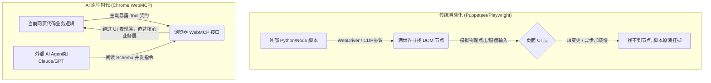

# 🚨 别再死磕 Puppeteer 了！Chrome 祭出“王炸”新 API，前端自动化面临彻底洗牌！


说实话，干了这么多年大前端，每次听到“网页自动化”、“E2E 测试”这几个字，我脑海里总会条件反射般地浮现出半夜爬起来修脚本的惨痛画面。

近期，我把 Chrome 升级到了 146 的早期预览版，特意为了折腾一下 Google 刚放出的那个大招——**WebMCP（Web Model Context Protocol）**。试用了一段时间后，我有一种强烈的预感：**咱们这套基于 DOM 节点的自动化测试和爬虫玩法，可能真的要被彻底颠覆了。**

今天不聊那些虚头巴脑的概念，咱们就以一个一线开发者的视角，扒一扒这个 WebMCP 到底是什么，它怎么用，以及它凭什么敢叫板我们用得滚瓜烂熟的 Puppeteer、Playwright、Cypress等前端自动化测试框架。

---

## 痛苦回忆录：那些年被 DOM 支配的恐惧

回想一下，平时我们是怎么做前端自动化或者写爬虫的？不管是老牌的 Selenium，还是后来居上的 Puppeteer、Playwright，抑或是专门为现代 Web 测试而生的 Cypress，它们底层的逻辑说白了都是一套“**从外向内看的黑盒操作**”。

你写出来的代码大概长这样：

```javascript
// 传统 Playwright/Puppeteer 里的典型操作
await page.waitForSelector('.nav > ul > li:nth-child(3) > a.btn-checkout');
await page.click('.nav > ul > li:nth-child(3) > a.btn-checkout');
await page.fill('#payment-input-v2', 'credit_card');
```

看着很丝滑对吧？但现实极其骨感。第二天产品经理说：“我觉得这个购买按钮放左边更好看，顺便把类名重构一下吧，换成 Tailwind。”——砰！你的自动化脚本全挂了，CI/CD 飘红，测试老哥提刀在来找你的路上。

这些传统框架就像是一个个“瞎眼的机器人”，它们不理解网页的业务逻辑，只能靠你给的物理坐标（CSS 选择器/XPath）去死记硬背。网页稍微改个版、加个弹窗、或者网络抖动导致元素晚加载了半秒，脚本分分钟死给你看。

---

## 破局者：彻底读懂 WebMCP 的底层哲学

要真正理解 WebMCP 的颠覆性，我们得先追溯它的老大哥——**MCP（Model Context Protocol，模型上下文协议）**。这是 Anthropic（开发 Claude 的那家公司）提出的一种标准，旨在解决 AI 代理如何规范地获取外部数据和执行动作的问题。

传统的 MCP 是跑在服务器后端的，比如让 AI 连上你的本地数据库。但 **Microsoft 和 Google** 的工程师在 W3C 社区组里一合计：**为什么不把这个协议搬到浏览器前端呢？** 于是 WebMCP 诞生了。

它的核心哲学是：**将浏览器从单一的“视觉文档渲染器”，升级为“语义化的能力接口面（Semantic Capability Surface）”。**

简单来说：
传统网页是给人看的，按钮画得花里胡哨，AI 只能像个“瞎子摸象”一样去猜去点。
而接入了 WebMCP 的网页，相当于给网站配备了一个“机器专用 API 网关”。网站主动把自己的能力封装成一个个带有严格 JSON Schema 描述的 **“工具（Tools）”**。

这是一种绝妙的**控制权反转（Inversion of Control）**：
不再是外部脚本试图“强行”和破解网页结构，而是网页主动向 AI 广播：“嗨，我这里有一个 `book_ticket`（订票）的工具，你需要传给我 `date` 和 `destination` 两个参数，填对了我就帮你办事。”



---

## 尝鲜指南：如何唤醒 Chrome 隐藏的 WebMCP 封印？

别急着往下看代码，既然是“隐藏大招”，这玩意儿目前还是个实验性特性。如果你现在用的是普通稳定版的 Chrome，是跑不起来的。

**环境要求与开启步骤**：
1. **浏览器版本**：你需要 **Chrome 149 或更高版本**（WebMCP 已作为 Origin Trial 正式提供）。如仅需本地开发测试，也可下载 **Chrome Canary 金丝雀版**并通过 Flag 启用。
2. **开启实验性 Flag**：在浏览器地址栏输入 `chrome://flags` 并回车。
3. **搜索并启用**：在搜索框输入 `WebMCP`（或者 `WebMCP for testing`），将对应的选项从 `Default` 改为 `Enabled`。
4. **重启浏览器**：点击右下角的 `Relaunch` 按钮重启浏览器。

> **✅ 验证方法**：重启后随便打开一个网页，按 F12 打开开发者工具控制台（Console），输入 `document.modelContext` 或者 `navigator.modelContext`（兼容） 并回车。如果打印出来的不是 `undefined` 而是个对象，恭喜你，新世界的大门打开了！

---

## 扒开源码：WebMCP 到底怎么用？

根据最新的 W3C Web Machine Learning 社区组草案，WebMCP 提供了两种截然不同的接入方式，兼顾了传统表单和复杂交互：

### 方式一：零 JS 侵入的“声明式 API”（Declarative API）
如果你的网站已经有很语义化的 HTML 表单，你甚至不需要写一行 JavaScript。只需在传统的 `<form>` 上加上几个特定的专属属性，Chrome 就能自动解析出 Schema 喂给 AI：

```html
<!-- 传统表单秒变 AI Agent 工具 -->
<form 
  toolname="request_demo" 
  tooldescription="提交 B2B 软件的试用演示申请"
  toolautosubmit
>
  <input name="company" placeholder="公司名称" />
  <input name="email" placeholder="工作邮箱" />
  <button type="submit">申请演示</button>
</form>
```
当 AI 填写并触发这个表单时，浏览器会派发一个附带 `SubmitEvent.agentInvoked = true` 属性的事件，你的前端和后端就能轻松识别出这是一个来自机器代理的操作，从而进行特定的免验证码放行或记录。

此外，你还可以在每个表单字段上添加 `toolparamdescription` 属性，为 AI 提供该字段的语义化描述（比如下拉框每个选项代表什么业务含义），从而大幅提升 AI 填表的准确率：

```html
<select name="category" required
  toolparamdescription="决定该工单路由到哪个处理团队">
  <option value="support">技术支持</option>
  <option value="billing">账单问题</option>
</select>
```

### 方式二：掌控全局的“命令式 API”（Imperative API）
针对复杂的后台仪表盘（比如复杂的条件过滤、图表操作），我们可以使用强大的 JavaScript API。

*注：WebMCP 的标准 API 统一挂载在 `document.modelContext` 上。如果你使用的是较早的 Canary 预览版，API 可能略有差异（可能挂载在 `navigator.modelContext`），建议升级到 Chrome 149+ 以获得最稳定的体验。*

```javascript
// 1. 获取全局 WebMCP 上下文，navigator.modelContext（兼容）
const mcpContext = document.modelContext || navigator.modelContext;

if (!mcpContext) {
    console.warn("当前浏览器不支持 WebMCP，作为 Fallback 可以退回到传统的 SEO 结构化数据注入");
} else {
    // 2. 主动向浏览器注册一个“工具”
    mcpContext.registerTool({
        name: 'filter_dashboard_data',
        description: '根据时间范围和订单状态过滤后台仪表盘数据',
        inputSchema: {
            // 这里用的是标准的 JSON Schema，AI 模型对这个极其熟悉
            type: 'object',
            properties: {
                dateRange: { 
                    type: 'string', 
                    description: '支持的范围，比如 "last_7_days", "today"' 
                },
                status: { 
                    type: 'string', 
                    enum: ['success', 'failed', 'pending'] 
                }
            },
            required: ['dateRange']
        },
        // 3. 当 AI 调用这个工具时，触发的核心逻辑
        execute: async ({ dateRange, status }) => {
            console.log(`🤖 AI 代理正在请求过滤数据: ${dateRange}, ${status}`);
            
            // 重点来了！直接调用你底层的状态管理或者 API，完全不碰 DOM！
            const result = await myAppStore.fetchDashboardData({ dateRange, status });
            
            // 给 AI 返回执行结果（必须遵循 MCP 标准的 content 返回格式）
            return {
                content: [{
                    type: 'text',
                    text: JSON.stringify({
                        status: 'success',
                        message: `成功过滤出 ${result.totalCount} 条记录`,
                        dataSummary: result.summary
                    })
                }]
            };
        }
    });
}
```

发现没有？在这个代码里，**你根本看不到任何诸如 `.btn-filter` 这种恶心人的选择器**。

当用户打开这个网页，并且唤醒了浏览器集成的 AI 助手时，用户只要输入：“帮我查一下过去 7 天失败的订单”，AI 会直接读取你注册的 `filter_dashboard_data` 工具，组装好 `{"dateRange": "last_7_days", "status": "failed"}` 的参数并调用 `execute` 方法。

**UI 怎么改都无所谓了！** 只要底层逻辑不变，AI 永远能通过这个“契约”稳定地帮你干活。

---

## 它是 Google 的独角戏吗？（关于跨浏览器支持）

很多人可能会问：“这又是 Chrome 搞的非标准实验性 API 吧？Firefox 和 Safari 不支持有什么用？”

其实不然。WebMCP 并非 Google 一家自嗨。目前该协议正在 **W3C Web Machine Learning Community Group（W3C Web 机器学习社区组）** 下孵化，由 **Microsoft 和 Google** 联合发起。
不仅是 Google，**Microsoft（Brandon Walderman 等）、Google（David Bokn 等）** 的工程师都是该规范的核心共同作者，**Apple 和 Mozilla** 也已加入该工作组进行标准共建：
*   **Chrome**：毫无疑问是一马当先，在 146 / 147 版本中作为参考实现领跑。
*   **Edge**：由于与 Chrome 共享 Chromium 内核，并且 Microsoft 也是核心发起者，很快就会实装。
*   **Safari / Firefox**：虽然目前没有明确的发布时间表，但 Apple 和 Mozilla 都已在 W3C 层面跟进。

在各大厂全部实装之前，社区也已经出现了基于 **MCP-B** 开源项目（WebMCP 规范的前身参考实现）衍生的 Polyfill 方案，以及诸如 `vite-plugin-vue-mcp` 等框架插件，可以帮你在生产环境中渐进式接入。

**对于 Vue 开发者来说：**
如果是构建 Vue 3 应用，可以通过非常优雅的 Composition API 语法结合社区的 Hook 库来编写你的工具集。甚至有人开源了 `vite-plugin-vue-mcp` 这样的 Vite 插件，能将你的 Vue 组件树和状态直接暴露给 AI！

```vue
<!-- Vue 3 组件中直接暴露 AI 工具的假想示例 -->
<script setup>
import { useWebMCP } from 'usewebmcp'; // 社区封装的 Vue composable
import { useOrderStore } from '@/stores/orders';

const orderStore = useOrderStore();

// 注册工具，让 AI 代理可以直接调用 Vue 的业务状态
useWebMCP({
  name: 'get_order_status',
  description: '查询订单状态，并更新 Vue 界面视图',
  inputSchema: { /*... JSON Schema ...*/ },
  execute: async ({ orderId }) => {
    // 调用 Pinia 状态管理
    const result = await orderStore.fetchOrder(orderId);
    return { content: [{ type: 'text', text: JSON.stringify(result) }] };
  }
});
</script>
```

---

## 降维打击：WebMCP 与传统前端自动化的深度对比

很多测试老哥可能会撇嘴：“不就是调接口吗？我用 Cypress/Playwright 写点自定义命令不也一样？”

完全不一样！我们把 Puppeteer、Playwright、Selenium 这些“老伙计”和 WebMCP 这个“新贵”放在一起，进行一次剥洋葱式的多维度拆解：

| 对比维度 | 传统自动化 (Puppeteer / Playwright) | WebMCP (AI 原生协议) | 核心赢家 |
| :--- | :--- | :--- | :--- |
| **交互媒介** | **DOM 节点与视觉元素** (CSS/XPath 坐标) | **语义化 API 契约** (JSON Schema 描述) | WebMCP（绝对精准） |
| **稳定性与维护** | **极度脆弱**。UI 重构、改个类名、弹窗遮挡瞬间崩溃，维护成本极高。 | **坚如磐石**。与 UI 彻底解耦，只要底层业务逻辑 API 不变，永不崩溃。 | WebMCP（免维护） |
| **运行上下文** | **冷启动（外挂式）**。需要外部脚本自己搞定登录、注入 Cookie、绕过验证码。 | **热状态（内嵌式）**。直接跑在用户当前激活的浏览器 Tab 里，共享用户全部登录态。 | WebMCP（环境免配） |
| **防爬与安全对抗** | **猫鼠游戏**。会被 Cloudflare 等轻易识别为无头浏览器（WebDriver 标记），遭遇无尽的滑块验证。 | **合法良民**。用户自己打开的页面，且网站主动暴露接口，免除一切爬虫人机验证。 | WebMCP（合规调用） |
| **执行者是谁** | 预先写死的、不知变通的 **死板代码**。 | 具备阅读、思考、决策能力的 **LLM 大模型代理**。 | WebMCP（智能决策） |
| **适用核心场景** | E2E 端到端回归测试、CI/CD 产物验证、视觉截图测试。 | 赋能 AI 助手、让 Agent 代替人类进行复杂网页填表、购票、搜集资料。 | **场景互补，非绝对替代** |

### 深刻差异 1：从“视觉抓取”到“契约调用”
传统自动化的本质是**模拟人类的物理动作**。它需要用代码指挥一只“无形的手”，把鼠标挪到屏幕坐标 `(x,y)`，然后点击。这导致了一个致命问题：现代前端框架（如 React/Vue）的 DOM 是动态生成的，类名经常带 Hash（如 `.btn-a7x9`），甚至一个弹窗没加载完，脚本就会因为 `Timeout waiting for selector` 而惨死。

而 WebMCP 是**面向契约编程**。AI 根本不看你的网页长什么样，它只看你抛出的 JSON Schema 说明书。你说只要给我传 `{"id": 123}` 就能加入购物车，AI 就直接通过 `document.modelContext` 或者 `navigator.modelContext`(兼容) 把数据丢给你。这种绕过渲染层、直捣黄龙的玩法，让 UI 自动化测试最头疼的“稳定性问题”迎刃而解。

### 深刻差异 2：运行环境的“外挂”与“内聚”
传统爬虫或自动化脚本，往往需要启动一个独立的无头浏览器（Headless Browser）。你需要写大量恶心的代码去模拟登录、保存 Token、处理跨域机制。

WebMCP 则是“寄生”在用户真实存活的浏览器 Tab 上的。用户已经扫码登录了淘宝，Cookie 都在，甚至安装了去广告插件。此时唤醒 AI 助手去调用 `add_to_cart` 工具，它是**带着用户完整的身份鉴权（Context）去执行的**。没有任何鉴权阻碍，这体验简直降维打击。

### 深刻差异 3：生态定位的不同（它会干掉 Playwright 吗？）
回答是：**不会，它们解决的是不同时代的问题。**

*   **Playwright / Cypress 永远是 QA 的好朋友**：如果你需要测试“当鼠标悬停时，那个 Tooltip 有没有正确弹出并变红”，或者“页面在不同分辨率下会不会变形”，你必须用传统框架，因为 WebMCP 根本不管 UI 长啥样。
*   **WebMCP 是下一代流量的入口**：它的目标不是为了给你跑 CI/CD 测试，而是为了让你的网站成为 **“AI-Ready（AI 友好型）”** 应用。未来的用户不再自己逛网页，而是告诉 Copilot：“帮我对比一下这三个网站的价格并买最便宜的”。如果你的网站没有接 WebMCP，AI 代理根本不知道怎么操作你的网站，你将直接失去未来的 AI 流量入口。

**局限性与避坑指南（非常重要）**：
*   **严格的活跃度依赖（别幻想当后台服务用）**：很多同学一定会好奇，*“如果我切换了 Tab、最小化了浏览器，甚至电脑锁屏了，AI 还能调用 WebMCP 吗？”* 答案是：**极其不可靠，且随时会断连**。WebMCP 属于“临时性（Ephemeral）”连接，与你当前的标签页（Tab）深度绑定。现代浏览器为了省电和省内存，会对处于后台、隐藏状态的 Tab 进行激进的 JS 节流（Throttling）甚至冻结休眠。一旦切后台或锁屏，AI 调用的网络请求极易超时或失效。WebMCP 的定位是**“用户在场的实时协助”**，想做 24 小时后台任务，还是得老老实实用回传统 MCP Server 或 Node 脚本。
*   **AI 不一定按套路出牌**：虽然你提供了一份完美的 JSON Schema，但并不是所有的 AI 模型都会老老实实遵守协议（存在幻觉）。官方在文档中特意警告：**千万不要完全信任 AI 传来的参数**，必须在 `execute` 函数内部手动写兜底的防御性参数校验。
*   **跨域安全壁垒**：WebMCP 受制于严格的浏览器沙箱机制。默认情况下，你注册的 API 只能在同源使用。如果有跨源或者第三方集成的需求，必须要开发者用 `exposedTo` 参数做严格的白名单声明。
*   **需要网站开发者配合**：传统爬虫是“霸王硬上弓”，别人不给你接口你也能硬爬。但 WebMCP 是一种“君子协议”，必须网站所有者愿意写代码暴露 API 才行。

---

## 写在最后：前端的下半场是“Agent-Ready”

试用了 WebMCP 之后，我最大的感触是：我们评估一个前端工程做得好不好的标准要变了。

以前我们卷首屏秒开、卷 SEO 骨架屏、卷无障碍设计（a11y）。但在可预见的未来，随着每个人桌面上都跑着一个 AI 助手，**“你的网站能不能让 AI 顺畅地理解和操作？”** 将成为生死攸关的指标。

试想一下，如果你的竞品网站早早接入了 WebMCP，用户的 AI 助理瞬间就能帮他完成跨站点的比价和一键下单；而你的网站不仅没有暴露接口，还挂着个极其复杂的滑块验证码防爬虫，导致 AI 根本操作不了。那你在未来的 AI 流量争夺战里，大概率要被截胡了。

当然，Playwright 和 Cypress 们绝不会消亡，它们会老老实实退回到“质量保证”的阵地中去。而 **WebMCP，则是把我们这帮前端工程师拽上了下一代“AI 原生交互”的牌桌。**

别等了兄弟们，是时候去下个 Chrome Canary 尝尝鲜了。这趟驶向“模型与网页直接对话”的列车，才刚刚鸣笛。

---